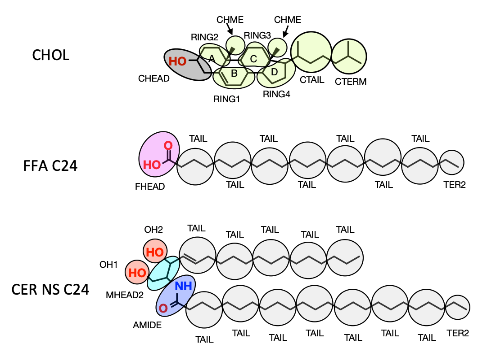

# Stratum Corneum Lipid Atomistic and Coarse-grained Force Fields
A coarse-grained (CG) force field derived using the multi-state iterative Boltzmann inversion method (MSIBI) [1] for simulating stratum corneum lipids. Provided in this repository are bonded parameters for CER [2], FFA [2], and CHOL [5], as well as non-bonded parameters for water taken from Moore et al. (2016) [3], CER NS and FFA self interactions from Moore et al. (2016) [2], CER NS and FFA cross-interactions from Moore et al. (2018) [4], and CHOL self- and cross-interactions with CER NS and FFA from Shamaprasad et al. (2022) [5]. See for more information about the CG force field see below. The remaining publications [6-9] are applications of these force fields.

##  Files
Tabulated non-bonded potentials can be found in the `coarsegrained/ff/nonbondedpotentials` directory. The directory contains a `.txt` file for each pair of atom types in the coarse-grained model. The `.txt` files are tab-separated tables in which the first column is the separation distance (*r*) in nm, the second column is potential energy (*V(r)*) in kJ/mol, and the third column is the force (*F(r)*) in kJ/mol-nm. Plots of the nonbonded potential energies can be found in the `nonbonded/figures/` directory.

Harmonic bonded interaction parameters can be found in the `coarsegrained/ff/bondedparameters` directory. Harmonic bonds are described in `bonds.txt` in which the first column of the tab-separated table is name of the bond (i.e. the atom types involved), the second column is the bond distance in nm, and the third column is the force constant in kJ/mol-nm^2. Similarly, harmonic angles are described in `angles.txt` where the first column is the angle name, the second column is the angle in degrees and the third column is the force constant in kJ/mol-rad^2.

## CG Mapping Scheme
Mapping schemes for CER NS C24, CHOL, and FFA C24 are shown below. Each circle corresponds to a CG bead, which represents the atoms encompassed by the circle. The CG beads are labled with their bead type. In  all cases, CG beads are spherically symmetric. Water is mapped such that four water molecules are represented by a single CG bead. 

# References
[1] Moore, T. C.; Iacovella, C. R.; McCabe, C. Derivation of Coarse-Grained Potentials via Multistate Iterative Boltzmann Inversion. J. Chem. Phys. 2014. https://doi.org/10.1063/1.4880555.

[2] Moore, T. C.; Iacovella, C. R.; Hartkamp, R.; Bunge, A. L.; McCabe, C. A Coarse-Grained Model of Stratum Corneum Lipids: Free Fatty Acids and Ceramide NS. J. Phys. Chem. B 2016. https://doi.org/10.1021/acs.jpcb.6b08046.

[3] Moore, T. C.; Iacovella, C. R.; McCabe, C. Development of a Coarse-Grained Water Forcefield via Multistate Iterative Boltzmann Inversion. In Foundations of Molecular Modeling and Simulation. Molecular Modeling and Simulation (Applications and Perspectives).; Snurr, R. Q., Adjiman, C. S., Kofke, D. A., Eds.; Springer: Singapore, 2016; pp 37–52. https://doi.org/10.1007/978-981-10-1128-3_3.

[4] Moore, T. C.; Iacovella, C. R.; Leonhard, A. C.; Bunge, A. L.; McCabe, C. Molecular Dynamics Simulations of Stratum Corneum Lipid Mixtures: A Multiscale Perspective. Biochem. Biophys. Res. Commun. 2018. https://doi.org/10.1016/j.bbrc.2017.09.040.

[5] Shamaprasad, P., Moore, T. C., Xia, D., Iacovella, C. R., Bunge, A. L., & MCabe, C. (2022). Multiscale Simulation of Ternary Stratum Corneum Lipid Mixtures: Effects of Cholesterol Composition. Langmuir, 38(24), 7496–7511. https://doi.org/10.1021/acs.langmuir.2c00471

[6] Nădăban, A., Frame, C. O., el Yachioui, D., Gooris, G. S., Dalgliesh, R. M., Malfois, M., Iacovella, C. R., Bunge, A. L., McCabe, C., & Bouwstra, J. A. (2024). The Sphingosine and Phytosphingosine Ceramide Ratio in Lipid Models Forming the Short Periodicity Phase: An Experimental and Molecular Simulation Study. Langmuir, 40(27), 13794–13809. https://doi.org/10.1021/acs.langmuir.4c00554

[7] Shamaprasad, P., Nădăban, A., Iacovella, C. R., Gooris, G. S., Bunge, A. L., Bouwstra, J. A., & McCabe, C. (2024). The phase behavior of skin-barrier lipids: A combined approach of experiments and simulations. Biophysical Journal, 123(18), 3188–3204. https://doi.org/10.1016/j.bpj.2024.07.018

[8] Frame, C. O., Shamaprasad, P., Deshpande, S., Quach, C. D., Gui, L. (Griffin), Iacovella, C. R., Bunge, A. L., & McCabe, C. (2025). A Transferable Coarse-Grained Model for Stratum Corneum Lipids: Ceramides NP, AP, and AS. Submitted 2025.

[9] Frame, C. O., Bunge, A. L., & McCabe, C. (2025). Integrating Multiscale Simulations with Experiments to Probe Effects of Ceramide Headgroup Structures in Stratum Corneum Lipids. Submitted 2025.
